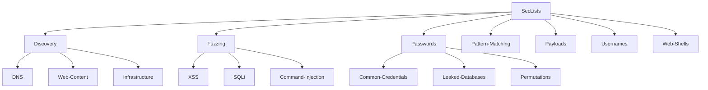

+++
date = '2025-09-26T20:58:20+10:00'
draft = false
title = 'SecLists - The Security Tester\'s Companion'
+++

# SecLists 🛡️

SecLists is the security tester's companion. It's a collection of multiple types of lists used during security assessments, gathered in one place. List types include usernames, passwords, URLs, sensitive data patterns, fuzzing payloads, web shells, and many more.


Created by Daniel Miessler, Jason Haddix, Ignacio Portal, and g0tmi1k with contributions from the community.


## 🎯 What's Inside

SecLists contains comprehensive wordlists for:

- **Usernames** - Common usernames for brute force attacks
- **Passwords** - Password lists for dictionary attacks
- **URLs** - Common paths and files for web application testing
- **Fuzzing Payloads** - Input validation testing payloads
- **Web Shells** - Various web shell implementations
- **Sensitive Data Patterns** - Patterns for finding exposed data

## 📦 Installation

### Quick Download
```bash
# Download as ZIP
wget -O SecLists.zip https://github.com/danielmiessler/SecLists/archive/master.zip
unzip SecLists.zip
```

### Git Clone
```bash
# Clone repository (full history)
git clone https://github.com/danielmiessler/SecLists.git

# Clone without history (faster)
git clone --depth 1 https://github.com/danielmiessler/SecLists.git
```

### Package Managers
```bash
# Kali Linux
sudo apt -y install seclists

# BlackArch
sudo pacman -S seclists
```


**Note**: Downloading this repository is likely to cause a false-positive alarm by your anti-virus software. The files are not harmful, but they contain patterns that security software may flag.


## 🚀 Usage Examples

```bash
# Use with Gobuster for directory brute forcing
gobuster dir -u https://example.com -w /path/to/SecLists/Discovery/Web-Content/directory-list-2.3-medium.txt

# Use with Hydra for password attacks
hydra -l admin -P /path/to/SecLists/Passwords/Common-Credentials/10-million-password-list-top-1000.txt ssh://target

# Use with Burp Suite for fuzzing
# Import wordlists from SecLists/Fuzzing/ directory
```

## 📊 Project Structure



## 🔗 Similar Projects

- **Assetnote Wordlists** - Automated wordlist generation
- **FuzzDB** - Application security fuzzing data
- **PayloadsAllTheThings** - Web application security payloads

## 📄 License

MIT License - Free to use in commercial and personal projects

## 🤝 Contributing

Contributions are welcome! Please read our contributing guidelines and submit pull requests for new wordlists or improvements.

## 📚 Resources

- [GitHub Repository](https://github.com/danielmiessler/SecLists)
- [Installation Guide](/docs/installation)
- [Wordlist Categories](/docs/lists)
- [Contributing Guide](https://github.com/danielmiessler/SecLists/blob/master/CONTRIBUTING.md)
