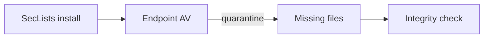

+++
title = "Detect Antivirus Scrubbing of SecLists Files"
description = "Verify that security software has not removed critical SecLists payloads."
draft = false
+++

<script type="application/ld+json">
{
  "@context": "https://schema.org",
  "@type": "FAQPage",
  "mainEntity": [{
    "@type": "Question",
    "@id": "https://seclists.dev/faq/seclists-antivirus-scrub",
    "name": "How do I detect when antivirus has removed SecLists payloads?",
    "acceptedAnswer": {
      "@type": "Answer",
      "text": "Run git status or compare directory hashes after deployment to identify missing files, and whitelist the SecLists directory in your endpoint protection."
    }
  }]
}
</script>

Security suites sometimes quarantine offensive payloads, shrinking SecLists silently.

## Verification

```bash
git status
# or
find SecLists -type f | sort | sha256sum > inventory.txt
```

Compare inventories across machines:

```bash
sha256sum -c inventory.txt
```

## Diagram



Whitelist `SecLists/` or move it to a controlled network segment to prevent tampering.
