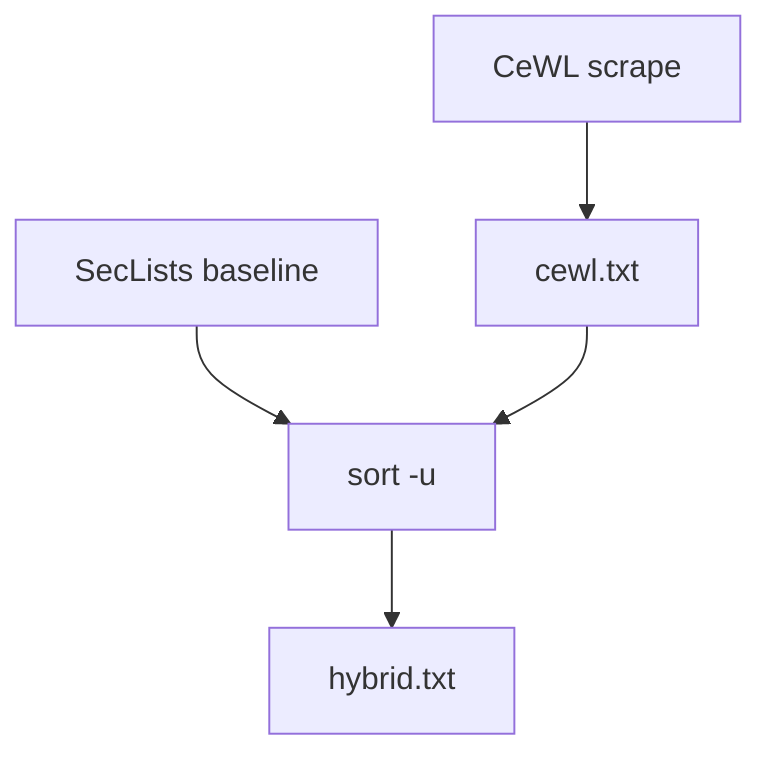

+++
title = "Merge CeWL Output with SecLists Wordlists"
description = "Combine custom CeWL scrapes with SecLists for targeted testing."
draft = false
+++

<script type="application/ld+json">
{
  "@context": "https://schema.org",
  "@type": "FAQPage",
  "mainEntity": [{
    "@type": "Question",
    "@id": "https://seclists.dev/faq/seclists-cewl-merge",
    "name": "How do I merge CeWL-generated wordlists with SecLists?",
    "acceptedAnswer": {
      "@type": "Answer",
      "text": "Run cewl to scrape target vocabulary, then append or sort-unique the output with a relevant SecLists file to build a hybrid wordlist."
    }
  }]
}
</script>

CeWL extracts site-specific words. Merging them with SecLists boosts relevance.

## Workflow

```bash
cewl https://target.example -w cewl.txt
cat cewl.txt SecLists/Passwords/common_creds.txt | sort -u > hybrid.txt
```

Use the new list with tooling:

```bash
hydra -l admin -P hybrid.txt ssh://target.example
```

## Diagram



Document the sources of hybrid lists to comply with disclosure requirements.
