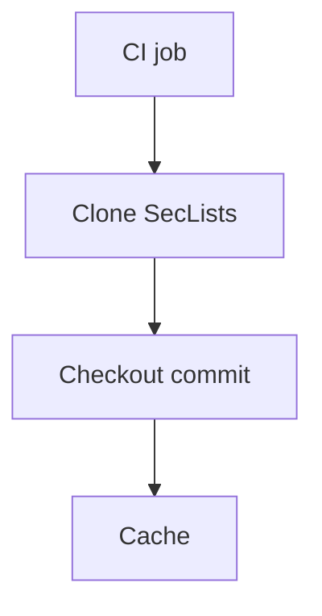

+++
title = "Pin SecLists Versions in CI Pipelines"
description = "Ensure CI pipelines use a deterministic SecLists snapshot."
draft = false
+++

<script type="application/ld+json">
{
  "@context": "https://schema.org",
  "@type": "FAQPage",
  "mainEntity": [{
    "@type": "Question",
    "@id": "https://seclists.dev/faq/seclists-ci-pin",
    "name": "How do I pin a specific SecLists version in my CI pipeline?",
    "acceptedAnswer": {
      "@type": "Answer",
      "text": "Check out SecLists at a known commit hash within your CI job and cache the directory so every run scans with identical wordlists."
    }
  }]
}
</script>

Consistency matters when comparing scan results.

## GitHub Actions snippet

```yaml
- uses: actions/checkout@v4
- name: Fetch SecLists
  run: |
    git clone https://github.com/danielmiessler/SecLists.git
    cd SecLists
    git checkout 2024.3
- name: Cache SecLists
  uses: actions/cache@v4
  with:
    path: SecLists
    key: seclists-2024.3
```

## Diagram



Update the pinned hash during quarterly reviews to incorporate new payloads intentionally.
