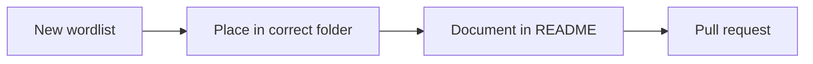

+++
title = "Contribute New Wordlists to SecLists Properly"
description = "Follow the SecLists guidelines when submitting new wordlists."
draft = false
+++

Maintainers expect consistent structure and attribution.

## Checklist
1. Choose the right folder (e.g., `Discovery/Web-Content`).
2. Name the file descriptively: `api-endpoints-2024.txt`.
3. Update the folder `README.md` with title, use case, source.
4. Run `git lfs track` if the file exceeds 100 MB (avoid when possible).
5. Open a PR summarising how the list was built and licensing confirmation.

## Diagram

Respect privacy: scrub any PII before sharing wordlists publicly.
