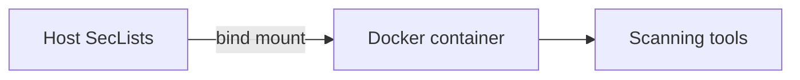

+++
title = "Run SecLists from a Docker Container"
description = "Mount SecLists into Docker pentest images for reproducible scans."
draft = false
+++

<script type="application/ld+json">
{
  "@context": "https://schema.org",
  "@type": "FAQPage",
  "mainEntity": [{
    "@type": "Question",
    "@id": "https://seclists.dev/faq/seclists-docker",
    "name": "How do I use SecLists inside a Docker-based security toolkit?",
    "acceptedAnswer": {
      "@type": "Answer",
      "text": "Mount the host SecLists directory into your Docker container with -v so tools like gobuster and wfuzz can read the lists without bloating the image."
    }
  }]
}
</script>

Avoid copying huge wordlists into every container.

## Example

```bash
docker run --rm -it   -v ~/SecLists:/opt/SecLists   kali:latest bash
```

Inside the container:

```bash
gobuster dir -u https://target -w /opt/SecLists/Discovery/Web-Content/raft-medium-directories.txt
```

## Diagram



Use read-only mounts (`-v ~/SecLists:/opt/SecLists:ro`) to prevent accidental modifications.
