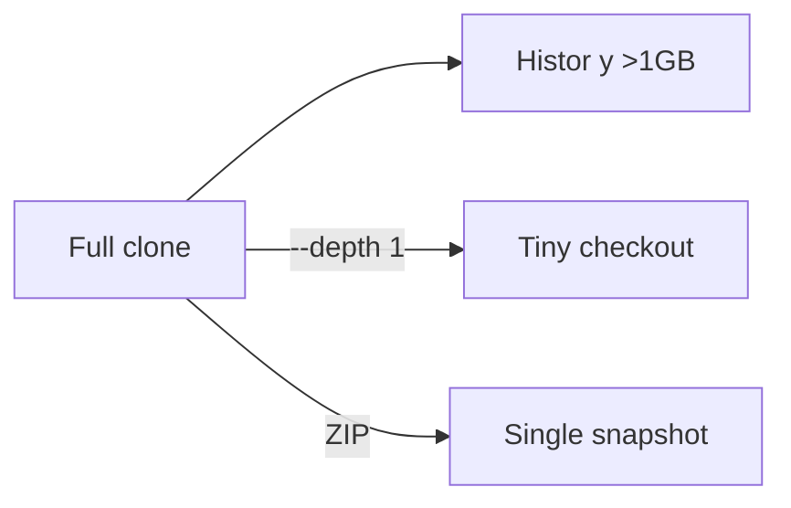

+++
title = "Download SecLists Without Full Git History"
description = "Grab only the latest SecLists files using shallow clones or ZIP archives."
draft = false
+++

<script type="application/ld+json">
{
  "@context": "https://schema.org",
  "@type": "FAQPage",
  "mainEntity": [{
    "@type": "Question",
    "@id": "https://seclists.dev/faq/seclists-download-without-history",
    "name": "How do I download SecLists without bringing the full git history?",
    "acceptedAnswer": {
      "@type": "Answer",
      "text": "Use git clone --depth 1 or wget the master.zip archive so you only fetch the current tree and reduce bandwidth."
    }
  }]
}
</script>

SecLists is large; shallow downloads keep usage light during audits.

## Options

```bash
git clone --depth 1 https://github.com/danielmiessler/SecLists.git
```

or

```bash
wget -O SecLists.zip https://github.com/danielmiessler/SecLists/archive/refs/heads/master.zip
unzip SecLists.zip
```

## Diagram



When you need history later, run `git fetch --unshallow` to convert the repo back to a full clone.
