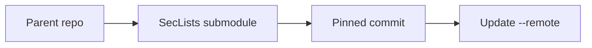

+++
title = "Track SecLists as a Git Submodule"
description = "Keep SecLists pinned and updated as a git submodule in audits."
draft = false
+++

<script type="application/ld+json">
{
  "@context": "https://schema.org",
  "@type": "FAQPage",
  "mainEntity": [{
    "@type": "Question",
    "@id": "https://seclists.dev/faq/seclists-git-submodule",
    "name": "How do I manage SecLists as a git submodule and keep it updated?",
    "acceptedAnswer": {
      "@type": "Answer",
      "text": "Add SecLists as a submodule, pin to a commit, and periodically run git submodule update --remote --merge to pull newer wordlists while preserving reproducibility."
    }
  }]
}
</script>

Submodules keep SecLists versioned alongside your tooling.

## Setup

```bash
git submodule add https://github.com/danielmiessler/SecLists.git third_party/SecLists
git commit -m "chore: add SecLists submodule"
```

## Update workflow

```bash
git submodule update --remote --merge third_party/SecLists
git add third_party/SecLists
git commit -m "chore: bump SecLists"
```

## Diagram



Document the pinned commit hash in release notes so other teams can reproduce the exact wordlists used.
