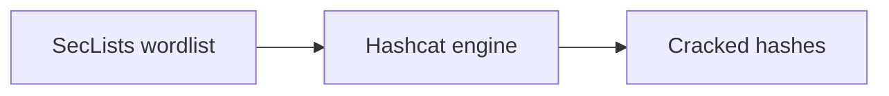

+++
title = "Use SecLists Passwords with Hashcat"
description = "Feed SecLists password lists into hashcat cracking sessions safely."
draft = false
+++

<script type="application/ld+json">
{
  "@context": "https://schema.org",
  "@type": "FAQPage",
  "mainEntity": [{
    "@type": "Question",
    "@id": "https://seclists.dev/faq/seclists-hashcat",
    "name": "How do I use SecLists password files with hashcat?",
    "acceptedAnswer": {
      "@type": "Answer",
      "text": "Point hashcat's -a 0 mode at a SecLists/Passwords wordlist and apply rules or masks to expand candidates during crack attempts."
    }
  }]
}
</script>

SecLists includes curated password corpora ready for `hashcat`.

## Basic usage

```bash
hashcat -m 1000 NTLM.hash         -a 0 SecLists/Passwords/Common-Credentials/100k-most-used-passwords-NCSC.txt         --status --status-timer=60
```

## Add rules

```bash
hashcat -m 1000 NTLM.hash         -a 0 SecLists/Passwords/xato-net-10-million.txt         -r rules/best64.rule
```

## Diagram



Keep password lists on secured storage and follow legal guidelines during engagements.
