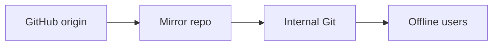

+++
title = "Mirror SecLists to an Internal Repository"
description = "Sync SecLists to private mirrors for offline or regulated environments."
draft = false
+++

<script type="application/ld+json">
{
  "@context": "https://schema.org",
  "@type": "FAQPage",
  "mainEntity": [{
    "@type": "Question",
    "@id": "https://seclists.dev/faq/seclists-internal-mirror",
    "name": "How do I mirror SecLists to an internal repository?",
    "acceptedAnswer": {
      "@type": "Answer",
      "text": "Clone the upstream repo, add your internal Git remote, and push regularly so offline environments receive the latest SecLists snapshot."
    }
  }]
}
</script>

Internal mirrors satisfy compliance when public internet is restricted.

## Workflow

```bash
git clone --mirror https://github.com/danielmiessler/SecLists.git
cd SecLists.git
git remote add internal git@example.com:mirrors/SecLists.git
git push internal --mirror
```

Schedule updates:

```bash
while true; do
  git fetch --all
  git push internal --mirror
  sleep 3600
done
```

## Diagram



Remember to sync large files responsibly—coordinate with your storage admins before pushing multi-GB repositories.
